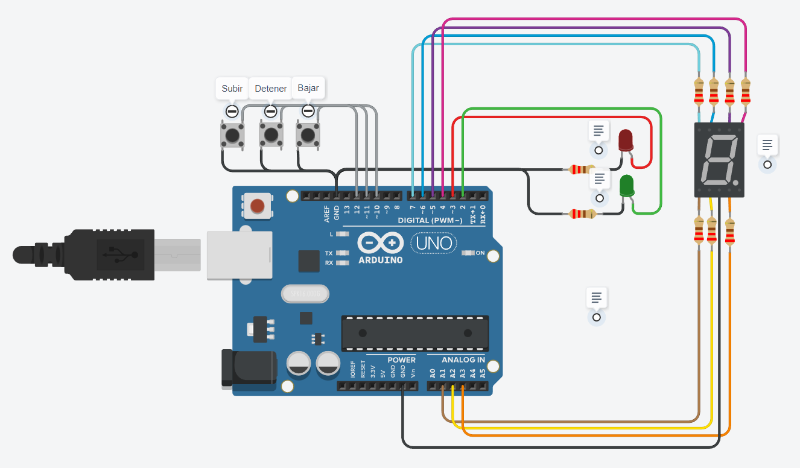

# **Proyecto Montacargas**

---
---
## Descripcion
---
El proyecto se basa en crear, en base a **Arduino**, el funcionamiento de un montacargas para un hospital. El mismo, debera tener 2 luces led (1 **verde** para indicar que el montacargas esta en *movimiento*, 1 **roja** para indicar que el montacargas esta *detenido*), 3 botones (1 para **SUBIR**, otro para **BAJAR** y otro para **DETENER**), y un **Visualizador 7 Segmentos** para indicarle al usuario el piso en el que se encuentra. El lapso de tiempo entre pisos es de 3 segundos.

---
---
## Funciones Principales
---

~~~ c++
void movimientoMontacargas()
{
  if(subir == 1 && detener == 0 && pisoActual < 9){
    pisoActual++;
  }else{
    if(bajar == 1 && detener == 0 && pisoActual > 0){
      pisoActual--;
    }
  }
  
  if((subir == 1 && pisoActual != 9) || (bajar == 1 && pisoActual != 0)){
    Serial.println("Montacargas en movimiento!");
  }else{
    if((pisoActual == 0 && bajar == 1) || (pisoActual == 9 && subir == 1)){
      subir = 0;
      bajar = 0;
      Serial.println("Montacargas detenido!");
    }else{
      Serial.println("Montacargas detenido!");
    }
  }
}
~~~
La funcion *"movimientoMontacargas()"*, como su nombre lo dice, se encarga de darle la orden al montacargas de que se mueva dependiendo de los **botones** que haya tocado el usuario, y tambien, depende de si el montacargas ha llegado a **Planta Baja** (0) o al **Ultimo Piso** (9); ya que en caso de que haya llegado a alguno de estos pisos, el montacargas se detendra de manera automatica sin necesidad de tocar el boton **Detener**. Ademas, tiene un algoritmo que no le permite al usuario usar el boton **Subir** al estar en el *Ultimo Piso*; y lo mismo para **Bajar** al estar en *Planta Baja*.

### Variables:
- **Subir**, **Bajar**, **Detener** son los que determinan el movimiento del montacargas de manera *"booleana"* :

    -> **1 = Verdadero**

    -> **0 = Falso**
- **pisoActual** sirve como *"Contador"*. Dependiendo de las anteriores variables, es el que sube, baja y detiene el montacargas, sumandose y restandose a si mismo.

---
~~~ c++
void funcionMillis()
{
  if(tiempoMillis - tiempoAlmacenado == tiempo){
    tiempoAlmacenado = tiempoMillis;
    movimientoMontacargas();
    sieteSegmentos();
  }
}
~~~
La funcion *"funcionMillis()"* es la funcion mas importante despues de *"movimientoMontacargas()"*. Su objetivo es contar el tiempo que transcurre al moverse de piso en piso, incluyendo lo que el usuario haya querido. (por ejemplo: Detener el montacargas en el piso 6). Esto se explica de la siguiente manera:

### Variables:
- **tiempo** es la variable del lapso de tiempo entre pisos, es decir, 3 segundos (3000 ms).
- **tiempoMillis** es la variable que se usa como *"contador de milisegundos"*. Esto es posible gracias a la funcion **"millis();"** que le permite contar en un lapso de milisegundos el tiempo que se mantiene encendido el *Arduino* desde que se encendio hasta los 50 dias; o hasta darle un algoritmo que le permita "detenerse".
- **tiempoAlmacenado** almacena el lapso de tiempo de 3 segundos (3000 milisegundos) por piso. Asi, cuando el *millis()* pase su segunda vuelta valdra 6000 milisegundos...
~~~ c++
//primera vuelta:
//   3000ms     -     0         =  3000
if(tiempoMillis - tiempoAlmacenado == tiempo){
 // tiempoAlmacenado = 3000   
    tiempoAlmacenado = tiempoMillis;

//segunda vuelta:
//   6000ms     -     3000         =  3000
if(tiempoMillis - tiempoAlmacenado == tiempo){
 // tiempoAlmacenado = 3000   
    tiempoAlmacenado = tiempoMillis;
~~~
Entonces, siguiendo la logica, a partir de la segunda vuelta *millis()* siempre valdra 3000 milisegundos. Lo cual es lo que buscamos, ya que el lapso entre pisos debe ser de 3000 milisegundos (3 segundos).
Luego se llama a las funciones de movimiento para realizar el funcionamiento del montacargas y el 7 segmentos para indicarle al usuario el piso en el que se encuentra.

---
---

## Link del Proyecto
---
- [Proyecto Montacargas](https://www.tinkercad.com/things/7WW3eKDlEor-1er-parcial-barbizan-franco-spd-1b/editel?sharecode=6TRkkuHqggxCCNkyeSi0K9F04-Z9rH4B162z3VfnkQs)